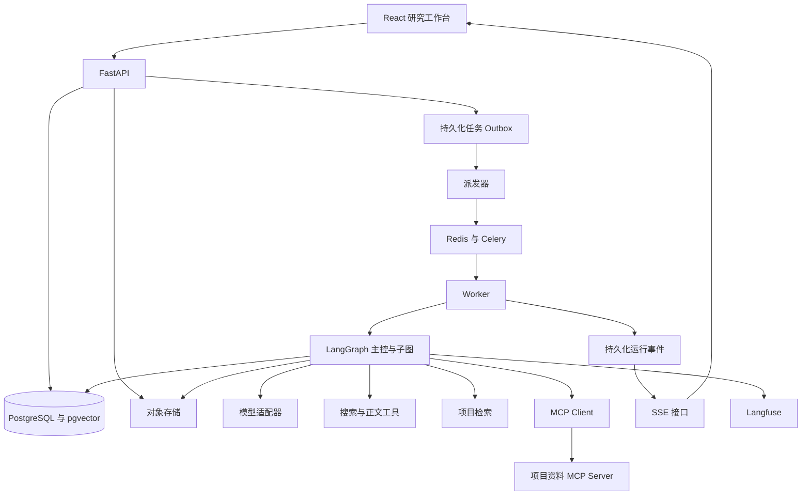
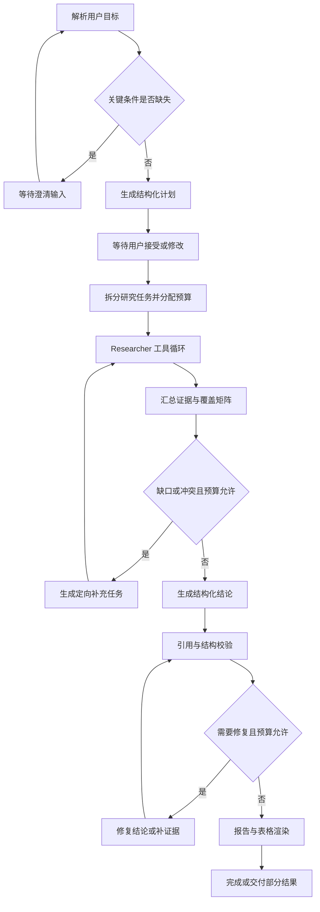

# Deep Research 工作台系统设计

> **目标架构。** 下表与总图描述的是规划中的生产形态（PostgreSQL、Celery、Redis、MCP、Langfuse、Tailwind、pnpm、Docker Compose 等）。当前实现是 Next.js（npm lockfile，样式在 `globals.css`，无 Tailwind）+ FastAPI + LangGraph `StateGraph` + SQLite + 进程内 `asyncio`；模型适配在 `llm.py` / `providers.py` 自写，不依赖 LangChain。阅读当前范围请看 [README](../README.md) 与 04/06/07。

系统采用前后端分离与后台 Worker。LangGraph 管理研究流程和检查点，Celery 管理任务派发，PostgreSQL 保存业务状态与证据，Redis 保存队列和短期缓存。研究结果以结构化结论和证据关联为核心，报告、对比表和演示稿从同一数据生成。

版本为 0.1，日期为 2026 年 10 月 7 日。当前落地为模块化单体；下文的队列、对象存储与观测组件仍是目标设计，不拆分业务微服务。

## 技术选型与职责

| 层 | 选型 | 职责与约束 |
| --- | --- | --- |
| 前端 | Next.js、React、TypeScript、Tailwind | 工作台、表格、报告编辑与 SSE 事件呈现 |
| API | Python、FastAPI、Pydantic | 身份校验、CRUD、命令、输入与输出 Schema |
| 编排 | LangGraph | 状态流转、分支、子图、循环、检查点和人工介入 |
| 模型接入 | LangChain 模型适配组件与原生 SDK | 统一生成、工具调用、结构化输出、用量；保留厂商特性 |
| 后台任务 | Celery、Redis | 派发、并发限制、文件处理和任务执行；不保存唯一业务状态 |
| 数据库 | PostgreSQL、pgvector、SQLAlchemy、Alembic | 关系数据、全文与向量检索、预算账本、事件和迁移 |
| 文件 | S3 兼容对象存储，本地可用 MinIO | 原文件、正文快照、成果文件与内容哈希 |
| 网络研究 | Tavily 适配器，正文清洗组件 | 搜索与提取；浏览器作为后续降级能力 |
| 文档解析 | PyMuPDF、Markdown 与 CSV 解析 | 页码、段落或行列定位；OCR 后置 |
| 工具协议 | 官方 MCP SDK | 自建项目资料库 Server 与外部工具接入 |
| 观测 | Langfuse | 模型、工具、子图轨迹；Prompt 与实验关联 |
| 测试交付 | pytest、Playwright、Docker Compose、CI | 单元、集成、故障恢复、端到端与可复现部署 |

嵌入模型和重排模型通过独立接口接入，评测后选择具体供应商。不同嵌入模型的向量空间不能混用；索引记录 embedding_model 与 index_version，换模型时重建索引。Python 依赖以 uv 锁定，前端依赖以 pnpm 锁定。

LangGraph 是唯一主编排。LangChain 仅使用必要的模型、工具和检索组件。多模型首先实现配置切换和故障策略，按任务复杂度路由留给对照实验，不预设路由一定提高效果。

## 总体结构



API 创建 run 与派发 Outbox 使用同一数据库事务，派发器发送队列消息后标记。消息可能重复；Worker 通过租约和幂等键处理。Redis 丢失时从数据库重新派发，任务事实以 PostgreSQL 为准。

首版一个 Worker 运行主控图，并在进程内以异步方式有限并行执行 Researcher 子图。子图使用独立检查点命名空间。需要更大规模时再将子任务外置为独立 Worker；首版避免在 Celery 任务里阻塞等待其他 Celery 子任务。

## 研究执行流程



主控图确定任务阶段与边界。Researcher 在受限工具集合中自主决定下一步，采用工具调用循环；固定的数据写入、导出和引用 ID 校验使用程序逻辑。

| 节点 | 输入 | 输出 | 关键检查 |
| --- | --- | --- | --- |
| clarify | 用户目标与项目背景 | ResearchRequest | 范围、对象、日期、交付物 |
| plan | ResearchRequest 与 Skill 摘要 | ResearchPlan | 子问题可执行、维度可验收、预算合法 |
| research | 子问题与上下文引用 | EvidenceBundle | 正文来源、定位、去重、工具权限 |
| gap_check | 证据与覆盖矩阵 | GapAssessment | 未覆盖维度、来源冲突、证据时效 |
| synthesize | 有效证据 | ClaimSet | 事实与推断分开，禁止凭空生成证据 ID |
| verify | ClaimSet 与原文 | VerificationResult | ID 存在、摘录一致、语义支持人工抽样 |
| render | 已校验结论与输出模板 | ArtifactVersion | 引用标记稳定，多个交付物共享结论 |

## 多 Agent 与上下文设计

Supervisor 负责拆分独立任务和分配预算，默认最大 3 个 Researcher。Researcher 以研究对象或独立子问题为边界，不按搜索、阅读、总结每一步创建一个 Agent。Writer 和 Verifier 首版为有明确输入输出的节点，避免无界 agent 相互对话。

子任务可访问限定项目工具，返回结构化证据摘要与数据库 ID，不把全部网页和聊天历史返回主控。失败子任务留下错误类型与已完成证据；其他子任务继续，主控决定局部重试或交付不完整结果。

上下文分层如下：

| 层 | 内容 | 加载策略 |
| --- | --- | --- |
| 固定指令 | 角色、工具边界、输出要求 | 每次调用提供短版本 |
| 当前任务 | 计划版本、子问题、比较维度、剩余预算 | 只加载相关范围 |
| 工作上下文 | 最近动作、局部摘要、未完成事项 | 达到阈值时压缩；保留引用与失败记录 |
| 证据 | 原文片段、来源、定位 | 检索与按 ID 读取，全文留在存储 |
| 项目记忆 | 已确认背景、用户显式偏好、历史结果 | 按项目与时效检索，不把旧结论直接当事实 |
| Skills | 专门方法、检查项、输出 Schema | 先加载名称与摘要，选中后加载正文 |

Skill 首版包括 competitor_analysis、industry_landscape、research_report。每个 Skill 保存版本、适用条件、必需维度、工具权限和结果要求。Skill 不得扩大应用授予的工具权限。

长文摘要不能覆盖原文证据；用户最新约束以结构化字段为准，避免摘要丢失。子任务输入、Prompt 和 Skill 版本写入轨迹，便于复现。

## 网络研究与 Agentic RAG

Agentic RAG 的含义是由 Agent 根据问题和证据缺口选择是否检索、检索哪里和何时继续；混合召回、融合和重排仍由确定性检索管线执行。

资料处理流程：上传到对象存储 → 格式与大小检查 → 异步解析 → 按页或段落分块 → 写入全文索引与向量 → 标记 ready。研究只使用 ready 状态的资料；解析失败明确提示，不能静默忽略。

初始检索配置可从全文和向量各召回 20 条开始，按内容哈希去重，经 RRF 融合后重排选取 6–10 条。数量为调优起点，依据评测调整。所有检索在召回前使用项目和身份过滤，不能先搜全库再事后过滤。

每个 chunk 保留 document_version_id、page、paragraph、行列范围或字符偏移。每次研究记录来源快照；网页被更新后，历史引用仍指向当时读取的快照。

网络来源按 canonical URL 与正文哈希去重。搜索摘要用于发现来源，只有成功读取正文才能作为事实依据。官方公告、原始论文、产品文档优先；多个转载来源记录共同上游，避免重复计数。发布时间未知时保留为空，不用获取时间替代发布时间。

## 证据与成果模型

核心关联为 SourceVersion → Evidence → Claim → ArtifactVersion。证据是不可变原文引用，结论可版本化，交付物引用某一版结论。

| 实体 | 主要字段 | 作用 |
| --- | --- | --- |
| users | id、认证主体 | 最小身份模型 |
| projects | id、owner_id、name、background、archived_at | 项目范围与权限 |
| conversations、messages | project_id、role、content、created_at | 用户交互记录 |
| documents、document_versions | project_id、object_key、hash、status、parser_version | 用户资料版本 |
| source_versions | project_id、URL、title、published_at、fetched_at、hash、snapshot_key | 网页或文件来源快照 |
| chunks | source_version_id、locator、text、embedding、index_version | 检索与定位 |
| runs | project_id、status、revision、plan_version_id、parent_run_id、budget、lease_epoch | 任务事实与并发控制 |
| plan_versions、research_tasks | run_id、scope、dimensions、dependencies、status | 计划与子任务 |
| evidence | task_id、source_version_id、locator、quote、hash | 可核对原文 |
| claims、claim_evidence | run_id、subject、dimension、text、type、status、evidence_id、relation | 结论与支持或冲突关系 |
| artifact_versions | project_id、run_id、parent_version_id、content_json、object_key、origin | 成果版本与编辑来源 |
| tool_operations | run_id、task_id、idempotency_key、status、input_hash、result_ref | 工具幂等与恢复 |
| usage_ledger | operation_id、reserved、actual、provider、tokens、price_version | 预算预留与实际用量 |
| run_events | run_id、seq、type、payload、created_at | 进度恢复 |
| dispatch_outbox | run_id、operation、delivery_status | 数据库任务派发 |
| decisions、run_commands | run_id、revision、payload、status | 澄清、计划确认、暂停与恢复 |

主要约束：run_events 的 run_id 与 seq 唯一；tool_operations 的 idempotency_key 唯一；artifact_versions 的 run_id、类型与 generation_key 唯一；所有业务资源可追溯到项目与所有者。引用使用稳定 evidence_id，展示时再生成序号。

LangGraph 检查点放在独立 Schema，通过 run_id 与子图命名空间关联，不要求业务表模仿框架内部表结构。

ResearchPlan 示例：

```json
{
  "version": 1,
  "subjects": ["产品 A", "产品 B"],
  "dimensions": ["用户", "功能", "定价", "部署方式"],
  "scope": {"as_of": "2026-10-07", "regions": ["中国", "全球"]},
  "tasks": [{"id": "task_1", "subject": "产品 A", "questions": ["当前套餐与部署方式"]}],
  "outputs": ["report", "comparison_table"],
  "limits": {"max_researchers": 3, "max_gap_rounds": 2, "max_tool_calls": 40}
}
```

## 任务状态与故障恢复

状态包括 queued、running、waiting_input、pause_requested、paused、cancel_requested、cancelled、completed、partial、failed。completed 表示计划要求的成果已生成，partial 表示预算耗尽、来源缺失或局部失败后交付可用结果。评测通过与否单独记录。

```text
queued → running
running → waiting_input → running
running → pause_requested → paused → queued → running
queued / running / waiting_input / paused → cancel_requested → cancelled
running → completed / partial / failed
```

暂停为协作式暂停：停止派发新调用，在安全边界写入检查点。用户修改执行中计划时，先暂停并生成计划新版本；旧版本晚到的子任务结果保留为历史数据，不进入新版本汇总。

Worker 获取数据库租约，并定期续约。租约失效后，恢复器递增 lease_epoch 重新派发。每次业务写入检查 epoch，阻止过期 Worker 发布结果；外部请求是否已消耗费用仍需单独记账。

恢复不能保证外部模型调用只发生一次。工具调用记录分为 pending、running、succeeded、failed、unknown。恢复时已成功的结果复用；不确定调用先核查供应商任务 ID，无法核查且是只读调用时按预算策略重试；外部写操作未纳入首版。

业务写入与对应 run_events 同事务提交。框架检查点可能使用另一事务，因此不宣称跨存储完全原子；使用 operation_id、已提交结果和阶段标记协调恢复。最终事件在成果提交后生成，终态任务不会自动重新执行。

并行预算采用数据库原子预留：调用前预留预计费用与调用数，完成后结算，失败或超时记录未知用量。达到上限停止新增调用，保留已在途调用的预留。预算是尽力控制的支出边界，实际费用可能受供应商计费和在途调用影响。

网络与限流错误有限指数退避并带随机抖动；Schema 错误最多有限修复；来源无法读取记录并选择替代来源；任务总时限、研究轮数、修复轮数和并发均有上限。

## API 与流式事件

| 方法与路径 | 用途 | 关键语义 |
| --- | --- | --- |
| POST /api/projects | 创建项目 | 返回 project_id |
| GET /api/projects/{id} | 项目详情 | 身份与项目校验 |
| POST /api/projects/{id}/documents | 上传资料 | 返回 document_id 与 processing 状态 |
| PATCH /api/projects/{id}/sources/{source_id} | 启用或停用来源 | 标记受影响结论，不自动丢弃历史快照 |
| POST /api/projects/{id}/runs | 创建任务 | Idempotency-Key；返回 202 与 run_id |
| GET /api/runs/{id} | 状态与成果 | 返回 revision、预算、缺失维度 |
| GET /api/runs/{id}/plan | 当前计划 | 返回 plan_version 与 revision |
| PUT /api/runs/{id}/plan | 修改计划 | expected_revision；冲突返回 409 |
| POST /api/runs/{id}/decisions | 提交澄清或接受计划 | decision_id 与 expected_revision；重复提交幂等 |
| POST /api/runs/{id}/commands | pause、resume、cancel | 返回 202；命令处理完成后发送事件 |
| GET /api/runs/{id}/events | SSE | 支持 Last-Event-ID，重放持久事件 |
| POST /api/runs/{id}/retry | 重试失败任务 | 新 attempt，保留成功步骤 |
| GET /api/projects/{id}/evidence/{evidence_id} | 查看原文 | 返回快照与定位 |
| POST /api/projects/{id}/runs/{run_id}/follow-ups | 增量研究 | 创建 parent_run_id 关联的新 run |
| PATCH /api/artifacts/{id} | 编辑成果 | 新版本；expected_revision |
| POST /api/artifacts/{id}/exports | 创建导出 | 异步导出、幂等 generation_key |
| GET /api/exports/{id} | 下载状态 | 授权后签发短期下载链接 |

事件类型包括 run.started、plan.proposed、task.started、tool.started、tool.finished、evidence.created、run.waiting_input、run.paused、artifact.created、run.completed、run.partial、run.failed。事件携带 run_id、seq、task_id、时间和结构化 payload。

事件保存在 PostgreSQL，Redis 通知只负责唤醒推送。前端按 seq 去重；历史事件过期时返回需要重新获取状态的信号。SSE 使用安全会话认证，不能通过任意 run_id 订阅其他用户任务。

## MCP 与工具边界

内置工具包括 search_web、read_url、search_project、read_evidence、extract_table。写入证据由受控服务方法执行，Agent 不能绕开来源校验直接新增任意 quote。

自建 Project Research MCP Server 暴露 search_project、read_source、read_evidence；project_id 和身份由服务端会话注入，不能信任模型提供的权限字段。资源 URI 只代表定位，仍需授权。

MCP 用于演示跨进程工具发现和接入，内部核心数据路径保留直接服务调用。工具名称、Schema、版本、超时和错误结构统一；接入外部 Server 时只启用允许的工具。

## 增量研究与成果交付

追加研究生成新 run，并记录父任务、来源集合和计划版本。新增对象只生成新增任务；修改某个维度只重算相应对象与受影响结论。复用条件包括来源仍启用、时效满足要求、口径适用和证据有效。

来源被停用或正文更新后，通过 claim_evidence 找到直接受影响结论，再定位使用这些结论的成果。旧版本保持可查看，新版本将受影响项标为 needs_review，补充研究后再生成。

报告使用结构化章节与 claim_id 引用，表格单元格关联 claim_id，演示稿使用同一批结论与图表。导出阶段不重新搜索或创造新事实。用户编辑的段落标记 origin=user，修改事实后引用状态回到待校验。

## 安全与部署

所有 URL 读取阻止本机、内网和云元数据地址，校验重定向目标并限制下载体积与时间。文件限制类型和大小，解析器在受限进程运行。网页和上传文件作为不可信资料，不能提升工具权限或覆盖系统指令。

密钥仅留在后端，日志和 Tracing 过滤密钥及敏感资料。评测使用公开或合成数据。来源快照默认只对项目所有者可见，不将全文作为公开作品内容传播。

P2 代码执行需独立沙箱服务，配置 CPU、内存、时间、文件挂载和网络限制，不在 API 或 Worker 宿主进程执行模型生成代码。浏览器任务限制域名与下载，并继承 URL 访问策略。

本地 Docker Compose 包含 frontend、api、worker、dispatcher、postgres、redis、对象存储；Langfuse 可用独立托管或独立 Compose，避免主系统启动被观测系统复杂度阻塞。生产环境迁移数据库、对象存储和 secrets 配置；规模提升后才引入更复杂调度。

## 主要风险与应对

| 风险 | 设计应对 | 验证方式 |
| --- | --- | --- |
| 搜索不到或读取失败 | 缺失标注、替代来源、partial 结果 | 注入超时和不可访问来源 |
| 多 Agent 重复研究与成本上升 | 独立任务范围、共享来源缓存、预算预留 | 与单 Agent 比较质量和费用 |
| 摘要丢失限制条件 | 结构化约束、原文持久化、引用 ID 保留 | 长任务追加约束测试 |
| 引用存在但不支持结论 | 程序校验加语义评分与人工抽样 | 人工标注 Claim 与 Evidence 对 |
| 恢复后重复执行 | 幂等键、租约 fencing、结果复用 | 工具完成与检查点提交之间结束 Worker |
| 用户编辑使证据失效 | 成果版本与待校验标记 | 编辑事实后检查引用状态 |

## 官方技术参考

- [LangGraph 编排与持久化](https://docs.langchain.com/oss/python/langgraph/overview)
- [LangGraph 状态与错误处理设计](https://docs.langchain.com/oss/javascript/langgraph/thinking-in-langgraph)
- [Skills 按需加载](https://docs.langchain.com/oss/python/langchain/multi-agent/skills)
- [MCP 架构](https://modelcontextprotocol.io/docs/learn/architecture)
- [pgvector 与混合检索](https://github.com/pgvector/pgvector)
- [Tavily 搜索与正文提取](https://docs.tavily.com/examples/quick-tutorials/cookbook)
- [Langfuse 评测](https://langfuse.com/docs/evaluation/overview)

参考资料支持组件能力。本文的数据模型、预算、恢复机制和接口为本项目设计；具体依赖版本与适配行为需在实现阶段锁定并通过集成测试验证。
